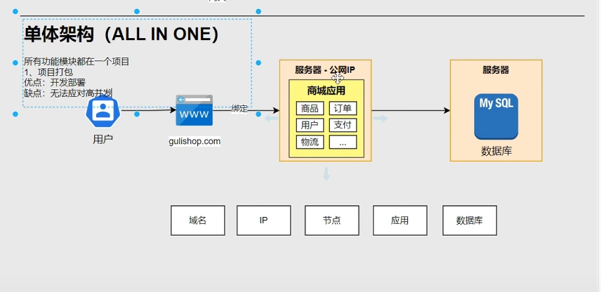
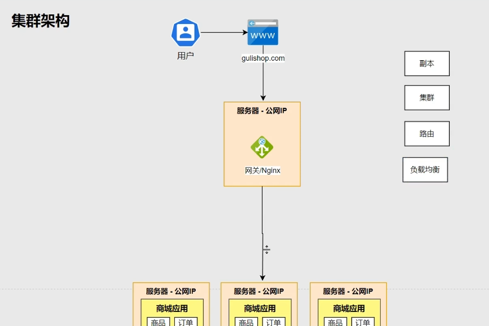

## 从单体到架构.md

### 单体架构
优点：
- 简单
- 容易部署
- 容易测试
缺点：
- 无法应对高并发

### 集群
- 副本，单体应用的复制。
- 集群，多个应用的多个实例，每个实例处理一部分请求。
- 负载均衡，将请求分发到多个实例。
- 路由，用户先访问一个域名，通过网关(负载均衡服务器)，在访问到多个服务器。
请求路由到多个服务器，每个服务器处理一部分请求。

- 扩容缩容
- 数据库同样需要使用集群，避免同一台数据库压力过大。

