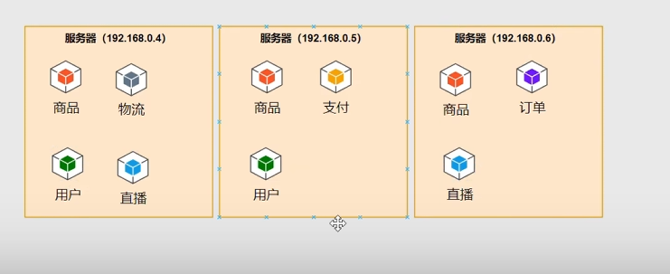
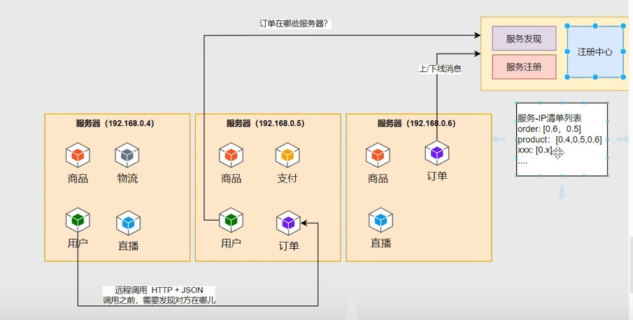
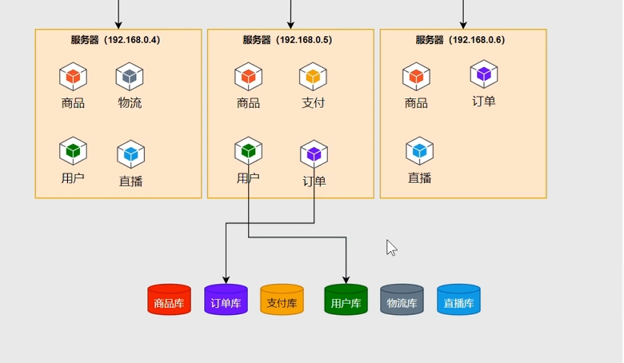
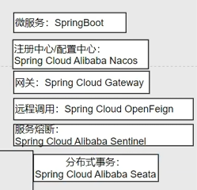
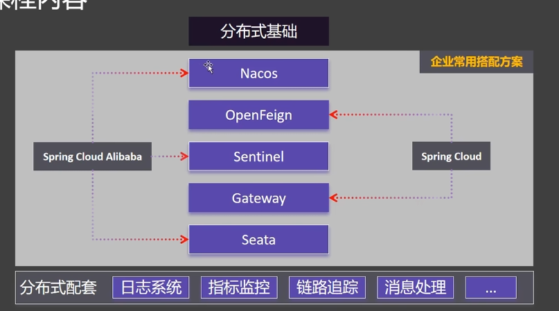

## 从集群到分布式架构

### 分布式
思考？ 为什么还需要分布式系统
- 如果某个系统（订单系统）需要经常升级，部署。分布式可以做到模板化。
- 如果需要引入直播功能，java并不适用开发该功能，需要用C++开发，模块之前可以相互调用。

我们按照业务拆分，每个模块又叫微服务，可以独立的开发，测试，部署，升级，扩展。  
数据库同样可以根据业务拆分，每个数据库只存储一部分数据。

### 部署架构
每一个服务器不在部署一个应用，而是部署多个微服务模块。对于访问量大的模块，可以部署多个实例。
- 单点故障，为了避免单点故障，不将所有的服务都部署在一个服务器上。
- RPC，远程调用，(Http+json是一种实现)因为服务都部署在不同的服务器上，需要使用RPC来调用。

### 注册中心
远程调用时，可以知道模块的地址，并且知道哪台服务器可能挂掉。
- 服务注册，每个微服务启动时，将自己的信息注册到注册中心。
- 服务发现，每个微服务需要调用其他微服务时，先从注册中心获取服务列表，然后调用。

### 配置中心
每个微服务都需要配置文件，但是配置文件可能会有变动，需要动态的更新。
- 统一管理所有配置的修改
- 推送配置变更

### 服务熔断
服务雪崩，如果某个服务器挂掉，依赖请求的这个服务器同样也等待响应，导致很多请求的等待，整个系统崩溃。
- 快速失败机制，如果某个服务器挂掉，直接返回错误。

### 请求路由
网关识别到请求后，也需要服务发现，将对应的请求分发到对应的服务器。
通常是用户请求中带有/order，网关识别到请求后，将请求分发到订单服务器。

### 分布式事务
存在业务，需要同时操作多个业务的数据库，订单新增，需要更新订单库和用户库(用户积分)

### 常用微服务组件

